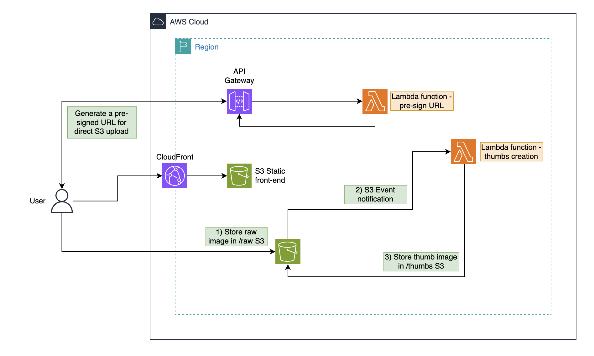

# Serverless Image Thumbnail Generator (AWS + Terraform)

## Overview

This project implements a **fully serverless AWS architecture** (defined and deployed using **Terraform**) that automatically generates thumbnails from images uploaded to Amazon S3.

The solution leverages **Lambda functions**, **API Gateway**, and **S3 event notifications** to orchestrate the process, while **CloudFront** serves a static front-end that interacts securely with the backend via **pre-signed URLs**.

---

## Architecture



## Workflow

1. **Frontend Upload Request**  
   The user accesses a static frontend hosted on **Amazon S3**, distributed globally via **CloudFront**.  
   When the user initiates an image upload, the frontend calls an **API Gateway endpoint**.

2. **Pre-signed URL Generation**  
   API Gateway triggers a **Lambda function** that generates a **pre-signed S3 URL**.  
   This allows the user to upload an image directly to the S3 bucket without exposing credentials.

3. **Direct Upload to S3**  
   The frontend uses the pre-signed URL to upload the image to an S3 bucket (e.g., in the `/raw` folder).  
   The upload is handled entirely by S3, keeping the backend lightweight.

4. **S3 Event Notification**  
   Once the image is successfully uploaded, S3 emits an **event notification**, which invokes another **Lambda function**.

5. **Thumbnail Creation**  
   This Lambda function processes the uploaded image, generates a thumbnail, and stores it back in the S3 bucket (in `/thumbs`).

---

## AWS Services Used

| Service                | Purpose                                                    |
| ---------------------- | ---------------------------------------------------------- |
| **Amazon S3**          | Stores raw uploads and generated thumbnails                |
| **AWS Lambda**         | Executes pre-signing logic and image processing            |
| **Amazon API Gateway** | Provides a public endpoint for generating pre-signed URLs  |
| **Amazon CloudFront**  | Distributes the static frontend and cached assets globally |
| **AWS IAM**            | Controls permissions and execution roles securely          |
| **Terraform**          | Defines and provisions the infrastructure as code          |

---

## Deployment

### Prerequisites

- [Terraform](https://developer.hashicorp.com/terraform/downloads) ≥ 1.12.x
- AWS account and configured credentials (`aws configure`)
- [Node.js](https://nodejs.org/en/) ≥ 22.x (for Lambda packaging or testing)

### Steps

```bash
# 1️⃣ Initialize Terraform
terraform init

# 2️⃣ Review the planned changes
terraform plan

# 3️⃣ Deploy the full stack
terraform apply
```

After deployment, the output will provide the CloudFront URL for accessing the static frontend.

```bash
# Destroy the infrastructure when no longer needed
terraform destroy
```

## Future Improvements

This project is a solid foundation, but several enhancements could make it more production-ready and feature-rich:

### Functionality

- Allow users to **preview or download the generated thumbnails** directly from the frontend.
- Add an API route to **list uploaded images** and associated thumbnails.
- Store image metadata (dimensions, format, upload date) in a DynamoDB table for better tracking.

### Security

- Protect the CloudFront distribution with **AWS WAF** or **signed URLs**.
- Implement different IAM roles for each Lambda function, following the **principle of least privilege**.

### Performance

- Use **S3 Transfer Acceleration** to speed up global uploads.

### Observability & Reliability

- Add **CloudWatch dashboards and alarms** to monitor errors, latency, and request counts.
- Store logs centrally using **AWS CloudWatch Logs Insights** or **AWS OpenSearch** for analysis.
- Implement **retries and DLQs (Dead Letter Queues)** for failed image processing events.

---

## Development Notes

Both the Lambda functions and front-end components were developed with the assistance of LLMs to accelerate prototyping.
The primary focus of this project is **cloud architecture** and **Infrastructure as Code (IaC)**, not application-level development.

---

## Summary

This project illustrates a **fully serverless image-processing pipeline** on AWS, deployed entirely through **Terraform**.

It demonstrates:

- Secure, direct image uploads via **pre-signed S3 URLs**.
- Event-driven processing using **S3 triggers** and **AWS Lambda**.
- Automatic thumbnail generation and storage in dedicated S3 folders.
- Global content delivery using **Amazon CloudFront**.

By separating logic from infrastructure and leveraging managed services, this architecture achieves:

- **Scalability** — automatic Lambda scaling and global CloudFront caching.
- **Cost-efficiency** — pay-per-use compute with minimal idle costs.
- **Maintainability** — clean IaC workflows.

This setup provides a robust foundation for future cloud-native applications that rely on event-based processing, serverless scalability, and globally distributed content delivery.

---

## 📫 Contact

If you’re interested in **AWS architecture**, **Terraform automation**, or **SaaS scalability**, feel free to reach out or start a discussion.

**Author:** antoinep23
**LinkedIn:** [https://www.linkedin.com/in/antoine-papyn-2b6614207/]
**GitHub:** [https://github.com/antoinep23]  
**Codemida:** [https://codemida.com]
